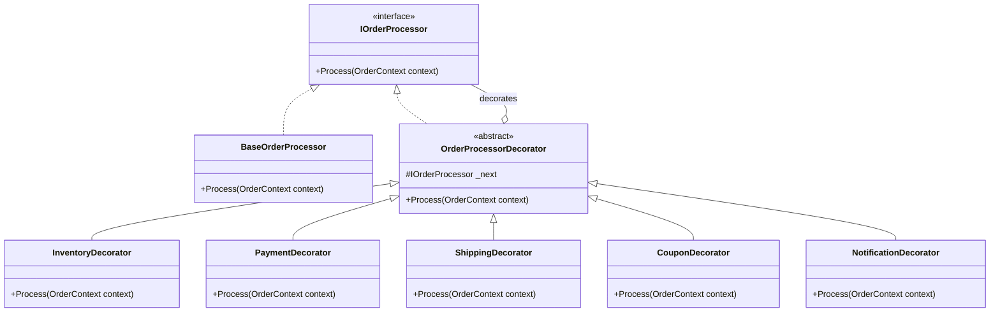

## 🥁 CarnaCode 2026 - Desafio 10 - Facade

Oi, eu sou o Ronaldo e este é o espaço onde compartilho minha jornada de aprendizado durante o desafio **CarnaCode 2026**, realizado pelo [balta.io](https://balta.io). 👻

Aqui você vai encontrar projetos, exercícios e códigos que estou desenvolvendo durante o desafio. O objetivo é colocar a mão na massa, testar ideias e registrar minha evolução no mundo da tecnologia.

### Sobre este desafio
No desafio **Facade** eu tive que resolver um problema real implementando o **Design Pattern** em questão.
Neste processo eu aprendi:
* ✅ Boas Práticas de Software
* ✅ Código Limpo
* ✅ SOLID
* ✅ Design Patterns (Padrões de Projeto)

## Problema
O processo de finalização de pedido envolve múltiplos subsistemas (estoque, pagamento, envio, notificação, cupons) cada um com interfaces complexas. 
O cliente precisa conhecer e orquestrar todos esses sistemas, resultando em código complexo e acoplado.

## Solução (Decorator Pattern)
Para resolver o problema de acoplamento e complexidade na orquestração, utilizamos o **Padrão Decorator**.
Este padrão estrutural permite adicionar funcionalidades a um objeto dinamicamente, "embrulhando-o" em camadas de comportamento.

No nosso contexto:
- Cada subsistema (Estoque, Pagamento, Envio) tornou-se um **Decorador**.
- O pedido passa por um **pipeline** onde cada decorador executa sua parte e chama o próximo.
- O cliente (`Program.cs`) apenas configura a cadeia e inicia o processo, sem conhecer os detalhes internos de cada etapa.

### Passos da Refatoração
1.  **Criação da Interface Comum**: Definimos `IOrderProcessor` para padronizar todos os processadores de pedido.
2.  **Criação do Contexto**: Implementamos `OrderContext` para encapsular o estado do pedido (dados, totais, IDs de transação) e permitir o compartilhamento de dados entre os decoradores.
3.  **Implementação Base**: Criamos `BaseOrderProcessor` como o componente inicial e `OrderProcessorDecorator` como a base para os decoradores.
4.  **Encapsulamento**: Transformamos a lógica de cada subsistema em um Decorator Concreto (`InventoryDecorator`, `PaymentDecorator`, etc.).
5.  **Novo Ponto de Entrada**: Criamos um novo `Program.cs` que monta a cadeia de decoradores e executa o fluxo.

### Estrutura de Arquivos
```text
src/
├── Challenge.cs           # Código legado (Subsistemas e Program antigo)
├── IOrderProcessor.cs     # Interface comum
├── OrderContext.cs        # Contexto de dados do pedido
├── OrderDecorators.cs     # Classes base (BaseOrderProcessor, OrderProcessorDecorator)
├── ConcreteDecorators.cs  # Implementações dos Decoradores (Inventory, Payment, etc.)
└── Program.cs             # Novo ponto de entrada (Runner)
```

### Diagrama de Classes


## Sobre o CarnaCode 2026
O desafio **CarnaCode 2026** consiste em implementar todos os 23 padrões de projeto (Design Patterns) em cenários reais. Durante os 23 desafios desta jornada, os participantes são submetidos ao aprendizado e prática na idetinficação de códigos não escaláveis e na solução de problemas utilizando padrões de mercado.

### eBook - Fundamentos dos Design Patterns
Minha principal fonte de conhecimento durante o desafio foi o eBook gratuito [Fundamentos dos Design Patterns](https://lp.balta.io/ebook-fundamentos-design-patterns).

### Veja meu progresso no desafio
[Repositório Central](https://github.com/ronaldofas/balta-desafio-carnacode-2026-central)
